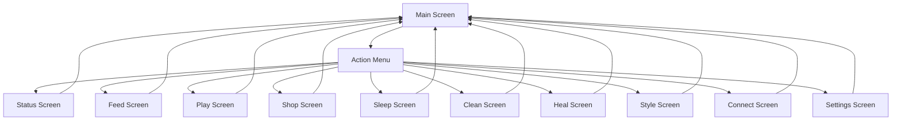

# Design of a Tamagotchi-like Project for ESP32 with LVGL

This document outlines the structure of the project for implementing a Tamagotchi-like game on an ESP32 device using the LVGL library. The project is organized into multiple files to ensure modularity and maintainability.

---

## **Project Structure**

The project consists of the following files:

1. **`main.cpp`**: The main file that initializes the hardware and LVGL, and contains the main loop.
2. **`ui.h`**: Header file for UI-related functions and declarations.
3. **`ui.cpp`**: Implementation of UI-related functions, including FPS handling.
4. **`pet.h`**: Header file for the virtual pet's logic and state management.
5. **`pet.cpp`**: Implementation of the virtual pet's logic and state management.
6. **`screens/`**: Folder containing the implementation of different screens:
   - `main_screen.h` and `main_screen.cpp`: For the main screen.
   - `action_menu.h` and `action_menu.cpp`: For the action menu.
   - `status_screen.h` and `status_screen.cpp`: For the status screen.
   - `feed_screen.h` and `feed_screen.cpp`: For the feeding screen.
   - `play_screen.h` and `play_screen.cpp`: For the play screen.
   - `shop_screen.h` and `shop_screen.cpp`: For the shop screen.
   - `sleep_screen.h` and `sleep_screen.cpp`: For the sleep screen.
   - `clean_screen.h` and `clean_screen.cpp`: For the cleaning screen.
   - `heal_screen.h` and `heal_screen.cpp`: For the healing screen.
   - `style_screen.h` and `style_screen.cpp`: For the style screen.
   - `connect_screen.h` and `connect_screen.cpp`: For the connection screen.
   - `settings_screen.h` and `settings_screen.cpp`: For the settings screen.

---

## **File Descriptions**

### **1. `main.cpp`**

**Description:**  
This file initializes the hardware, LVGL, and contains the main loop for updating the UI and pet logic.

**Functions:**
- `setup()`: Initializes the display, LVGL, and sets up the initial UI.
- `loop()`: Continuously updates LVGL and the pet's state.

---

### **2. `ui.h`**

**Description:**  
Header file for UI-related functions and declarations.

**Functions:**
- `void ui_init()`: Initializes the UI components.
- `void show_main_screen()`: Displays the main screen.
- `void show_action_menu()`: Displays the action menu.
- `void show_status_screen()`: Displays the status screen.
- `void show_feed_screen()`: Displays the feed screen.
- `void show_play_screen()`: Displays the play screen.
- `void show_shop_screen()`: Displays the shop screen.
- `void show_sleep_screen()`: Displays the sleep screen.
- `void show_clean_screen()`: Displays the clean screen.
- `void show_heal_screen()`: Displays the heal screen.
- `void show_style_screen()`: Displays the style screen.
- `void show_connect_screen()`: Displays the connect screen.
- `void show_settings_screen()`: Displays the settings screen.
- `void update_fps()`: Updates the FPS counter.
- `uint32_t get_fps()`: Returns the current FPS value.

---

### **3. `ui.cpp`**

**Description:**  
Implementation of UI-related functions, including FPS handling.

**Functions:**
- `void ui_init()`: Sets up the main screen, buttons, and other UI elements.
- `void update_fps()`: Updates the FPS counter and displays it on the screen.
- `uint32_t get_fps()`: Returns the current FPS value.
- Functions to switch between screens (`show_main_screen()`, `show_action_menu()`, etc.).

---

### **4. `pet.h`**

**Description:**  
Header file for the virtual pet's logic and state management.

**Functions:**
- `void pet_init()`: Initializes the pet's state.
- `void pet_update()`: Updates the pet's state over time.

---

### **5. `pet.cpp`**

**Description:**  
Implementation of the virtual pet's logic and state management.

**Functions:**
- `void pet_init()`: Initializes the pet's state variables.
- `void pet_update()`: Updates the pet's state (e.g., hunger, happiness) over time.

---

### **6. `screens/`**

**Description:**  
Folder containing the implementation of different screens.

**Files:**
- **`main_screen.h` and `main_screen.cpp`**:  
  - Implements the main screen with the pet, background, and navigation buttons.
  - Functions: `main_screen_init()`, `change_room()`.
- **`action_menu.h` and `action_menu.cpp`**:  
  - Implements the action menu with buttons for different actions.
  - Functions: `action_menu_init()`.
- **`status_screen.h` and `status_screen.cpp`**:  
  - Implements the status screen to display the pet's detailed status.
  - Functions: `status_screen_init()`.
- **`feed_screen.h` and `feed_screen.cpp`**:  
  - Implements the feed screen to feed the pet.
  - Functions: `feed_screen_init()`.
- **`play_screen.h` and `play_screen.cpp`**:  
  - Implements the play screen to play with the pet.
  - Functions: `play_screen_init()`.
- **`shop_screen.h` and `shop_screen.cpp`**:  
  - Implements the shop screen to buy items for the pet.
  - Functions: `shop_screen_init()`.
- **`sleep_screen.h` and `sleep_screen.cpp`**:  
  - Implements the sleep screen to put the pet to sleep.
  - Functions: `sleep_screen_init()`.
- **`clean_screen.h` and `clean_screen.cpp`**:  
  - Implements the clean screen to clean the pet.
  - Functions: `clean_screen_init()`.
- **`heal_screen.h` and `heal_screen.cpp`**:  
  - Implements the heal screen to heal the pet.
  - Functions: `heal_screen_init()`.
- **`style_screen.h` and `style_screen.cpp`**:  
  - Implements the style screen to customize the pet's appearance.
  - Functions: `style_screen_init()`.
- **`connect_screen.h` and `connect_screen.cpp`**:  
  - Implements the connect screen to connect with other devices.
  - Functions: `connect_screen_init()`.
- **`settings_screen.h` and `settings_screen.cpp`**:  
  - Implements the settings screen to adjust game settings.
  - Functions: `settings_screen_init()`.

---

## **Screen Interaction Diagram**

Below is a Mermaid diagram showing the relationship between the screens and how to navigate from one to another.

---

## **Summary**

This project structure ensures a clean separation of concerns, making it easier to manage and extend the Tamagotchi-like game. The `main.cpp` file handles initialization and the main loop, while the `ui` and `pet` modules manage the UI and pet logic, respectively. The `screens/` folder contains the implementation of all the different screens, ensuring modularity and maintainability.